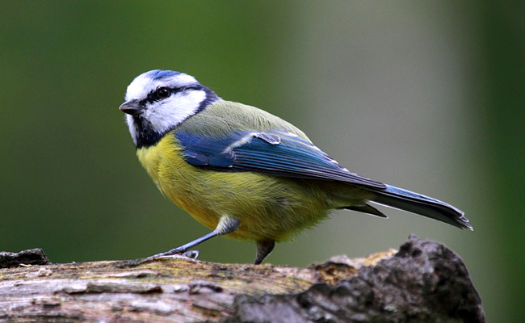

--- 
title:
- TP EVACO Mésange bleue 
author: 
- benjamin.girardot@univ-amu.fr
date:
- 16 & 18 Septembre 2019
documentclass:
- article
geometry:
- margin=1in
linestretch:
- 1.25
--- 

La plupart des processus biologiques ont une composante temporelle. 
La phénologie est l'étude du calendrier des évènements saisoniers du cycle de vie. 
La phénologie des organismes actuels a évoluée afin d'otpimiser leurs déplacements au cours de l'année pour arriver à leur lieu de migration à la bonne période. 
Par exemple, certaines espèces arrivent au moment coicidant avec le pic de resources disponibles à cet endroit. 

D'autres facteurs influencent aussi cette période d'arrivée optimale, comme la compétition. En effet, chez des espèces béliqueuses, et si le nombre d'aires de reproduction est limitant, le premier arrivé sera le premier servi. 
Mais arriver trop tôt pour sécuriser un territoire aura aussi des conséquences, en raison des conditions environnementales, alors non clémentes.
On s'attend donc à un subtil mélange entre ces différents compromis, de façon à arriver assez tôt sur un territoire non occupé, mais assez tard pour profiter de conditions propices à être apte à se reproduire. De plus, arriver trop tard ne laissera que peu de temps pour profiter de cette période de reproduction. 

Dans ce TP nous allons étudier la phénologie de *Cyanistes caenuleus* (mésange bleue), espèce de paridés, caractérisée par un comportement migratoire partiel en Europe et un comportement batailleur, particulièrement pour l'accès aux sites de nidifications (Figure 1). 
Nous étudierons dans une seconde partie l'impact de perturbations (e.g. réchauffement climatique) sur la phénologie de cette espèce. 
On notera que framework developpé dans ce TP peut cependant s'appliquer à d'autres espèces ayant un comportement similaire (e.g. lekking/hibernating species).

# Le modèle: analyse analytique et premières conclusions   

Notre organisme d'étude sera caractérisé par le trait $x$, qui correspondra à sa date d'arrivée sur l'aire migratoire / de reproduction. 

On veut construire et étudier un modèle d'un organisme qui prend en compte: 

+ des coûts reproductifs pour une arrivée trop précoce ou trop tardite sur site. Cela traduit le fait qu'arriver trop tôt expose un individu à des conditions environnementales trop rudes, impactant ainsi sa condition et donc son succès reproductif. Au contraire arriver trop tard lui laissera peu de temps pour profiter de la période de reproduction. 

On note donc le succès reproductive d'un individu $R(x)$, avec $R(x)$ ayant un maximum pour $x_{opt}$ traduisant ces coûts reproducifs. 

+ un bénéfice à arriver tôt pour un accès à un territoire non occupé (et donc aux ressources limitantes, par exemple des larves d'insectes dans notre cas).

On note $C(x)$ la compétitivité d'un individu. On considère donc que $C(x)$ est une fonction décroissante de $x$. 

On note $K$ le nombre de territoires disponibles (riches en ressource limitante). On fait l'hypothèse qui si un individu ne parvient pas à sécuriser un territoire, alors il ne parviendra pas à produire de descendants pour l'année en question. 

Enfin, on fait les hypothèses suivantes: 

+ les individus survivent à l'année suivante avec une probabilité $p$. 

+ il y a plus d'individus que de territoires disponibles.

**1) Définir la dynamique démographique d'une population résidente $n_{t+1} =...$**

**2) Déterminer la taille de la population à l'équilibre démographique $n^*$ et sa stabilité**

**3) Quelle est dans ce cas la date d'arrivée $x$ qui maximise la taille de la population ?**

On considère maintenant l'invasion par un mutant de taille de population $n_t'$ et de date d'arrivée $x'$.

**4) Quelles sont les dynamiques démographiques jointes ? (modèle mutant-résident)**

**a) montrez tout d'abord que le nombre de sites occupés par le type $x$ est donné par: $\displaystyle \frac{KN(t)C(x)}{N(t)C(x)+N'(t)C(x')}$** 

**b) en déduire le modèle mutant-résident**

Dans le cas d'un modèle en temps discret, on définit la fitness d'invasion comme le taux de croissance annuel (taux de croissance géométrique) d'un mutant, initialement rare (hypothèse 1) , dans une population résidente à l'équilibre démographique (hypothèse 2). 

On note cette fitness d'invasion $f(x',x)$. 

**5) Montrez que $f(x',x)=(1-p)\frac{C(x')R(x')}{C(x)R(x)} + p - 1$**

**6) Déterminez le gradient de fitness $f'(x',x)$. En déduire l'équation canonique. Analyser les directions d'évolution.**

Pour aller plus loin, on a besoin désormais de spécifier des fonctions $R(x)$ et $C(x)$. 

On pose $\displaystyle C(x) = exp(-ax)$ et 
$\displaystyle R(x) = R_0 exp(- \frac{(x-x_{opt})^2}{2\sigma^2} )$

**7) Déterminez $x^*$. Cette singularité est-elle ESS ?**

(**8) Déterminez la taille de la population à l'ESS $n^*$. Que pouvez-vous en conclure ?**)

# Perturbations environnemantales et réponses phénologiques  

On va maintenant étudier les effets que peuvent avoir de perturbations telles que le réchauffement climatique sur la phénologie d'espèces migratrices. 
Les changements phénologiques sont parmi les plus documentés en ce qui concerne les effets biologiques du réchauffement climatique actuel. 
Une question qui préocuppe la commnauté scientifique est de déterminer la mesure dans laquelle les espèces seront capables de s'adapter à de tels changements et ajuster leurs phénologies et ainsi "restaurer la synchronie" des interactions entre espèces. 
Cependant, une telle question présuppose que la phénologie des consommateurs, via l'évolution, tend à matcher parfaitement l'abondance maximale de leurs ressources. 

Or on a vu que dans certains cas, et notamment dans le cas de la mésange bleue, cela n'est pas forcément le cas.
Dans la suite de ce TP, on va donc étudier les impacts que peuvent avoir une telle considération sur les réponses écologiques face au réchauffement climatique chez *Cyanistes caenuleus*. 

**1) Comment prendre en compte dans notre modèle les effets de perturbations type réchauffement climatique ?**

**2) Représentez les effets immédiats d'un shift d'optimum reproductif ($x_{opt}$) sur la taille de la population à l'équilibre. On prendra par default $x_{opt}=50$, $\sigma=10$, $r0=2.5$, $K=5$, $p=0.2$, $a=0$**

+ a) créer un repertoire de travail TP_mesange_bleue, comprenant README.md, Codes/, Figures/ 

+ b) Se placer dans TP_mesange_bleue/Codes/ et créer un premier programme (fonctions.py) qui comprendra les fonctions nécessaires à déterminer la taille de la population à l'équilibre 

+ c) créer un deuxième programme (effets_immediats.py) qui, tout d'abord, représente graphiquement (subplot 1) la taille de la population à l'équilibre, pour un historical mismatch croissant ($x_{HM}$). On fera varier $a$ pour modifier l'historical mismatch.

+ c) enfin, représenter (subplot 2) la nouvelle valeur de la taille de la population suite à une perturbation environnementale de type 'shift d'optimum reproductif' pour chacunes de ces valeurs d'historical mismatch. 
	
+ d) Idem avec une augmentation de la longueur de la période reproductive ($\sigma$,subplot 3). Que peut-on en conclure ?

+ e) Sauvegarder les figures dans ../Figures/

On va maintenant étudier comment les densités de populations sont affectées par des changements environnementaux sur le long terme, c'est à dire après une phase d'évolution vers une nouvelle stratégie ESS. 

**4) Est-ce qu'un changement d'optimum reproductif affectera cette nouvelle valeur de taille de la population à la nouvelle ESS ? et un changement de $\sigma$ ?** 

**5) Représentez les effets à long terme sur la taille de la population à l'équilibre de changements environnementaux de types a) shift d'optimum et b) augmentation/diminution de la longueur de la période reproductive. Conclure**

 

